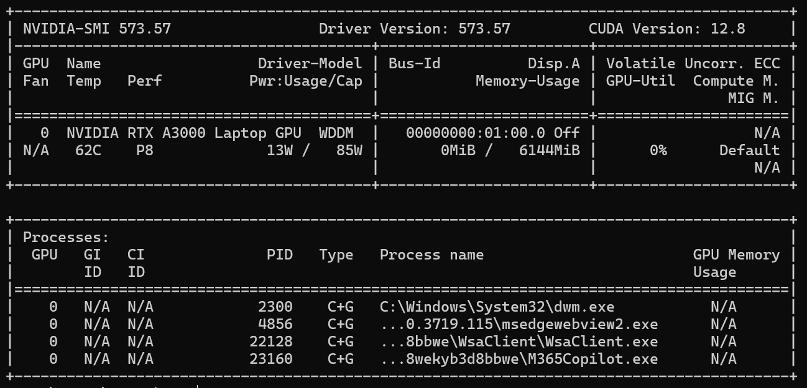
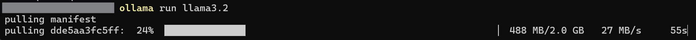
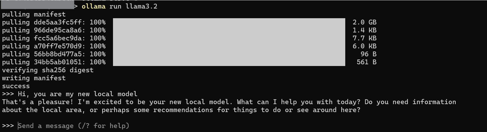
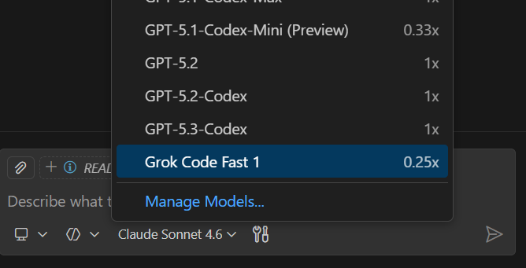
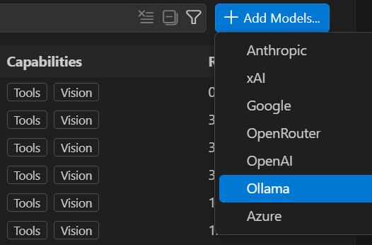
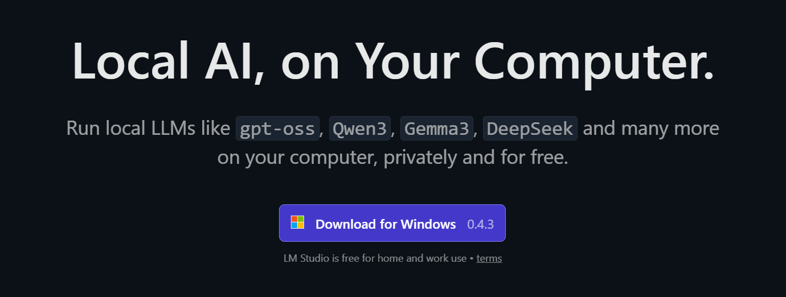
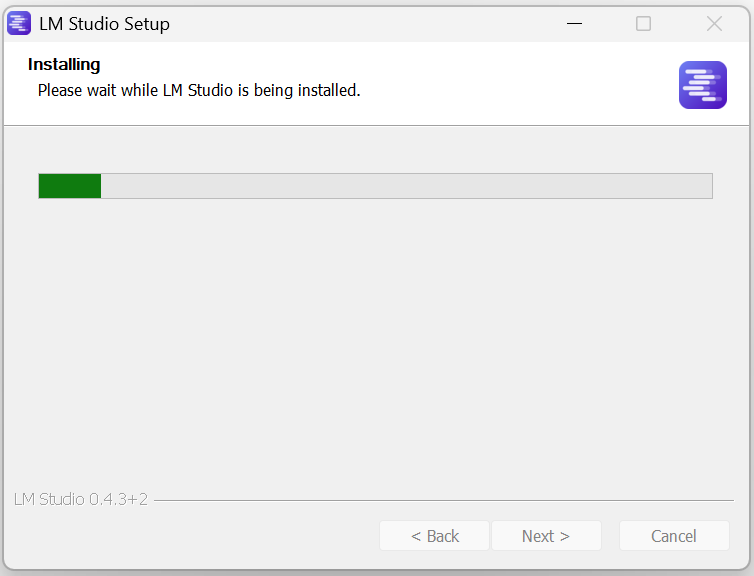
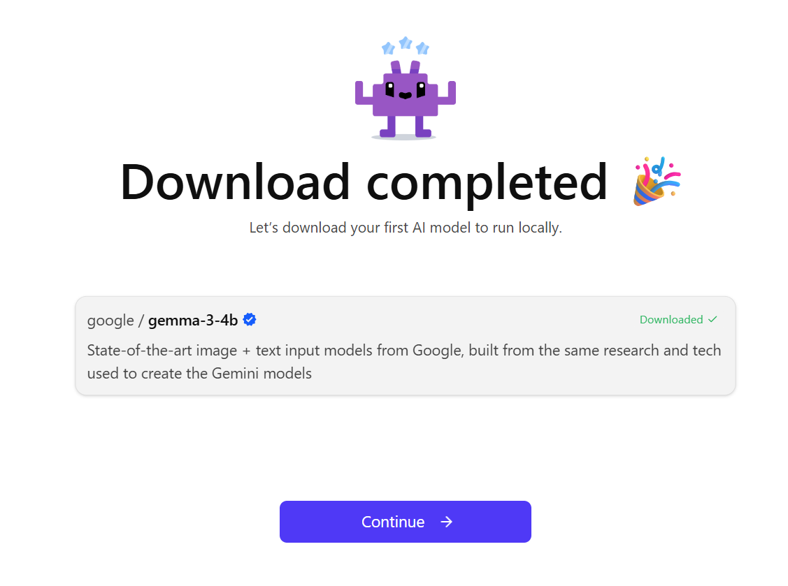
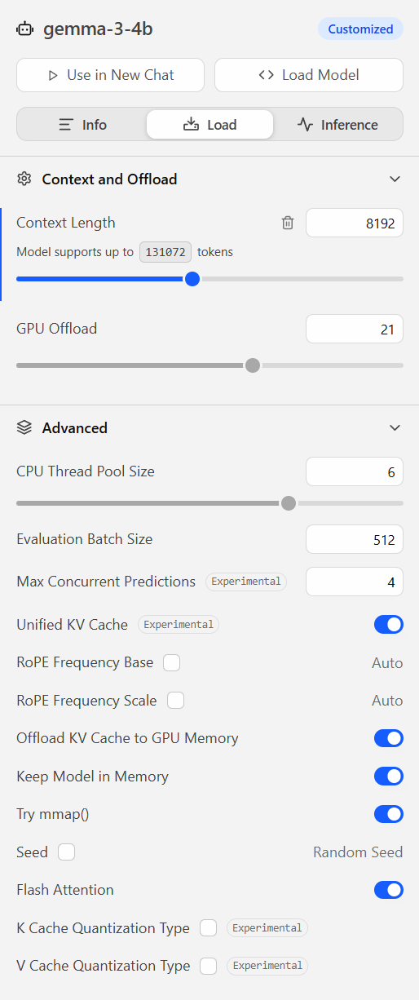

# Local LLM Setup on Windows with Ollama and LM Studio (Lenovo ThinkPad P1 Gen 4 with a RTX A3000 6GB VRAM)

[Ref: appsoftware.com/blog](https://www.appsoftware.com/blog/local-llm-setup-on-windows-with-ollama-and-lm-studio-lenovo-thinkpad-p1-gen-4-with-a-rtx-a3000)

## Introduction

This is a walkthrough of my set up of local LLM capability on a Lenovo ThinkPad P1 Gen 4 (with a RTX A3000 6GB VRAM) graphics card, using **Ollama**for CLI and VS Code Copilot chat access, and **LM Studio** for a GUI option.

My Lenovo ThinkPad P1 Gen 4 is coming up for 4 years old. It is a powerful workstation, and has a good, but by no means state of the art GPU in the RTX A3000. My expectation is that many developers will have a PC capable of running local LLMs as I have set up here.

## Setting up Ollama

For the Ollama set up, we will start with the Llama 3.2 model 3B (3 Billion parameter), which will work well on a machine of this spec.

In Powershell run the Ollama installer:

<https://ollama.com/download/windows>

```powershell
irm https://ollama.com/install.ps1 | iex
```

Initial Run: Once installed, an Ollama icon will appear in your system tray. The installer automatically adds the "ollama" command to your PATH, so you can use it in any terminal.

Check NVIDIA drivers active:

```powershell
nvidia-smi
```



Run the `ollama serve` comman

```powershell
ollama serve
```

If you see an error like `Error: listen tcp 127.0.0.1:11434: bind: Only one usage of each socket address (protocol/network address/port) is normally permitted.` - this means that Ollama was actually already running.

Run `ollama run llama3.2`. This will default to the 3B (3 Billion parameter) version of Llama 3.2 which is approximately 2GB in size.

```powershell
ollama run llama3.2
```



**What the initial run command does:**

Pulling Manifest: It fetches a small file that tells your computer which "layers" (the brain parts) it needs to download.

Downloading Layers: You'll see several progress bars. For Llama 3.2 3B, the total download is roughly 2.0 GB.

Verifying/Checksum: It double-checks that the download wasn't corrupted.

Interactive Chat: Once it hits 100%, the prompt will change to >>>, and you can start talking to the model immediately.



### Initial Setup is Complete

You can now chat with Llama 3.2!

```
>>> Send a message (images/? for help)
```

### Performance and Optimisation

Performance Verification: While you are chatting, open a new terminal and type ollama ps.

The "100% GPU" Goal: Under the "PROCESSOR" column, it should say 100% GPU. If it says "CPU/GPU," it means your context window is too big and it's spilling into your system RAM, which will slow it down.

```powershell
ollama ps
```

Expected output:

```
NAME               ID              SIZE      PROCESSOR    CONTEXT    UNTIL
llama3.2:latest    a80c4f17acd5    2.8 GB    100% GPU     4096       4 minutes from now
```

**How to check what you have:**

If you want to see exactly what has finished downloading onto your ThinkPad, you can open a second terminal window and type:

```powershell
ollama list
```

Expected output:

```powershell
NAME               ID              SIZE      MODIFIED
llama3.2:latest    a80c4f17acd5    2.0 GB    6 minutes ago
```

Type `/bye` to close the session and return to the terminal prompt.

Set the `OLLAMA_FLASH_ATTENTION` environment variable to 1.

Flash attention chunks data in memory so that it can stay inside of the faster on-chip SRAM rather than having to move it to VRAM.

```powershell
[System.Environment]::SetEnvironmentVariable("OLLAMA_FLASH_ATTENTION", "1", "User")
```

Confirm this is working after the next chat with the model:

```powershell
Get-Content "$env:LOCALAPPDATA\Ollama\server.log" -Tail 100 | Select-String "flash"
```

You should see an indication that flash attention is enabled.

```powershell
llama_context: flash_attn    = auto
llama_context: Flash Attention was auto, set to enabled
```

### Running Other Models

To run other models such as Google's Gemma 3 4B, use the `ollama run` command with the desired model, e.g.

```powershell
ollama run gemma3:4b
```

The `OLLAMA_FLASH_ATTENTION=1` environment variable you set earlier is global. Once configured it in your system, it will automatically drive Flash Attention for Gemma 3 or any other supported model run through Ollama.

### Using Ollama via Github Copilot Chat in VS Code

By default, Ollama blocks requests from external applications for security. You must allow VS Code to communicate with it:

Open PowerShell as Administrator.

Run this command to allow the VS Code webview:

```
[System.Environment]::SetEnvironmentVariable("OLLAMA_ORIGINS", "vscode-webview://*", "User")
```

Quit Ollama from the system tray and restart with `ollama run <model>` the change to take effect.





Once Ollama is configured, you can switch the model inside the Copilot interface:

Open the GitHub Copilot Chat view in VS Code.

Click the Model Picker dropdown at the bottom of the chat panel.

Select "Manage Models...".

In the providers list, select Ollama.

Confirm the defaults `Ollama`, `http://localhost:11434`

Find your model, in the list and ensure it is toggled ON.

Return to the chat and select the model from the model dropdown.

## Setting Up LM Studio for Llama 3.2

For a GUI based local LLM, I have set up LM Studio. This is a more user friendly experience

Run the Windows installer from <https://lmstudio.ai/>





`google / gemma-3-4b`



Turn on Developer Mode when given the option.

### Tuning

Most of the defaults are fine, the adjustments I made were.

Context Length: I have set this to 8192 tokens is roughly 15-20 pages of text. That is plenty for most coding tasks and keeps the VRAM usage well within the 6GB limit. For larger files, I can bump it to 32768, but but this will likely hit performance .

GPU Offload: I have maximised this to use every layer on the GPU to ensure optimal speed.




## Power and Cost Considerations

The RTX A3000 is a mobile workstation GPU. It is much more efficient than a desktop gaming card.

Idle: When the model is loaded but you aren't typing, your GPU uses roughly 5–10 Watts.

Active Generation: When the model "thinking" and spitting out text, the power draw spikes to about 35–60 Watts.

The Math (UK Price Cap ~27.7p per kWh):

Sustained "Chatting" (1 hour): If you spent a full hour constantly generating text (which is rare, as you spend most of your time reading), it would cost you roughly 1.5p per hour.

Realistic Daily Use: If you use your local AI for 3 hours an evening for coding and research, you are adding about £0.03 to £0.05 to your daily electric bill.

Verdict: Even if used every single day, the electricity cost will likely be less than £1.50 per month. It is significantly cheaper than a cloud subscription for Claude, Chat GPT, Gemini etc.

## Conlusion

If you've got this far I hope you've found this walkthrough useful. Comment if you think there's something that should be added.
